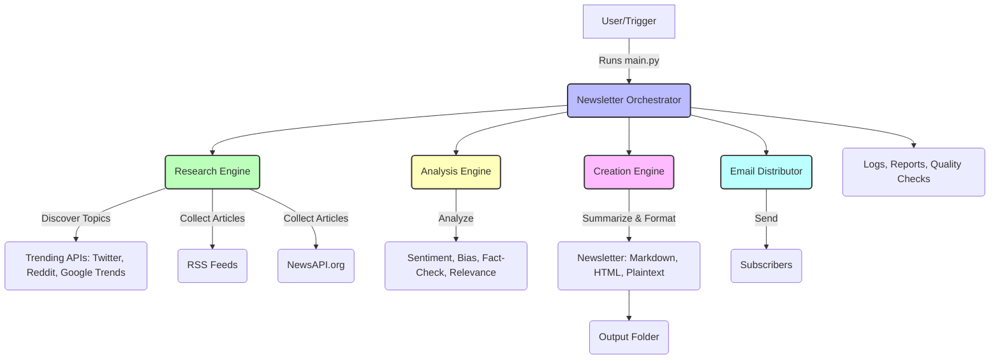
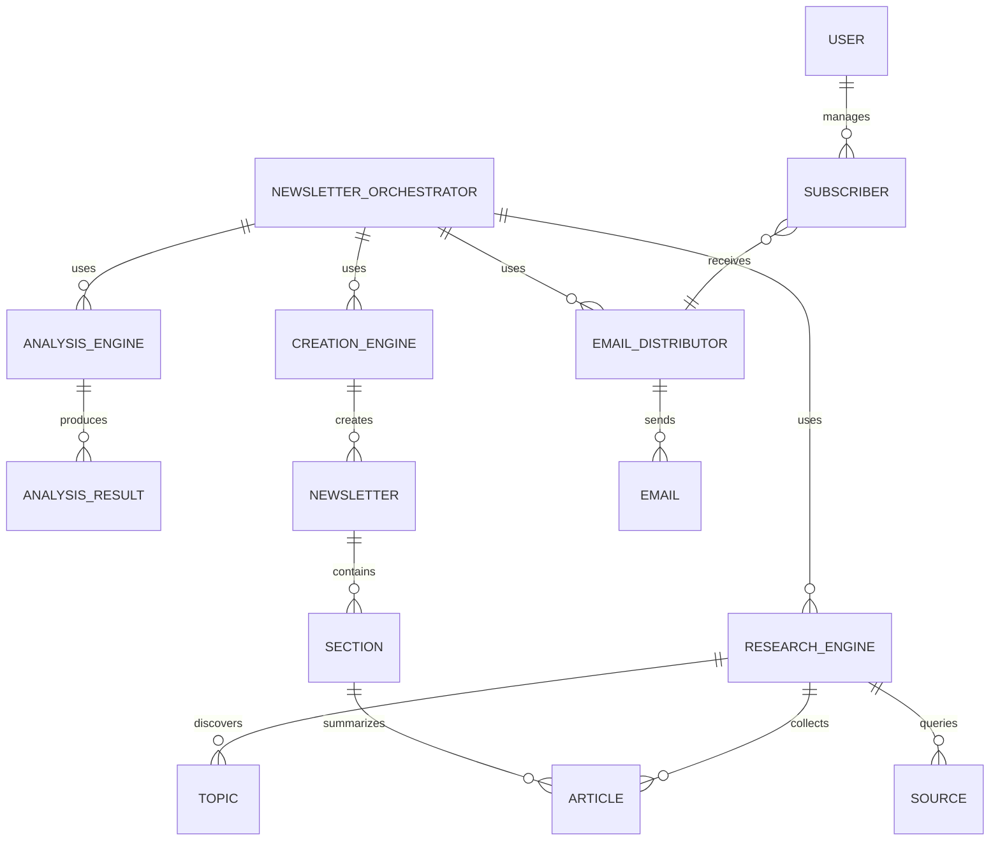

# 🤖 AI Newsletter Generator

> **Automated AI-powered newsletter generation with research, analysis, and email distribution**

[](https://python.org)
[](LICENSE)
[]()

## 🚀 Features

- **🔍 AI Research Engine**: Discovers trending topics from multiple sources
- **📊 Content Analysis**: Sentiment analysis, bias detection, and fact-checking
- **✍️ AI Content Creation**: Generates professional newsletters with AI summarization
- **📧 Email Distribution**: Automated email sending with subscriber management
- **🎯 Quality Assurance**: Comprehensive quality checks and reporting
- **⚙️ Fully Configurable**: Customizable themes, sources, and quality thresholds
- **📈 Analytics**: Delivery tracking and performance metrics

## 🏗️ Architecture

```
┌─────────────────┐    ┌─────────────────┐    ┌─────────────────┐    ┌─────────────────┐
│   Research      │    │   Analysis      │    │   Creation      │    │   Email         │
│   Engine        │───▶│   Engine        │───▶│   Engine        │───▶│   Distributor   │
└─────────────────┘    └─────────────────┘    └─────────────────┘    └─────────────────┘
│                     │                     │                     │
├─ RSS Feeds         ├─ Sentiment Analysis ├─ AI Summarization  ├─ SMTP Sending
├─ News APIs         ├─ Bias Detection     ├─ Content Writing   ├─ Subscriber Mgmt
├─ Social Media      ├─ Fact Checking      ├─ Format Generation ├─ Delivery Tracking
└─ Topic Discovery   └─ Relevance Scoring  └─ Quality Control   └─ Analytics
```

## 📊 System Architecture & Flow

### System Flow Diagram



### Entity-Relationship Diagram



## High-Level Architecture

- **Research Engine**: Discovers trending topics, collects articles from RSS feeds and NewsAPI.org.
- **Analysis Engine**: Analyzes articles for sentiment, bias, fact-checking, and relevance.
- **Creation Engine**: Summarizes and formats articles into a newsletter (Markdown, HTML, Plaintext).
- **Orchestrator**: Coordinates the workflow, manages quality checks, and saves outputs.
- **Email Distributor**: Sends newsletters to subscribers via email.
- **Config/Examples/Docs**: All configuration, sample scripts, and documentation are organized for easy onboarding and extension.

---

For more details, see `docs/ARCHITECTURE.md` and `docs/DEPLOYMENT.md`.

## 📦 Installation

### Prerequisites
- Python 3.8 or higher
- Gmail account (for email distribution)

### Quick Start

1. **Clone the repository**
   ```bash
   git clone https://github.com/yourusername/ai-newsletter-generator.git
   cd ai-newsletter-generator
   ```

2. **Install dependencies**
   ```bash
   pip install -r requirements.txt
   ```

3. **Download spaCy model**
   ```bash
   python -m spacy download en_core_web_sm
   ```

4. **Set up email (optional)**
   ```bash
   python setup_email.py
   ```

## 🎯 Usage

### Basic Usage

```bash
# Generate a newsletter with default theme
python main.py --generate

# Generate with custom theme
python main.py --theme "Startup News"

# Run demo with sample data
python main.py --demo

# Interactive mode
python main.py --interactive
```

### Email Distribution

```bash
# Set up email authentication
python setup_email.py

# Send demo newsletter to your email
python send_demo_newsletter.py

# Schedule weekly newsletters
python main.py --schedule
```

### Subscriber Management

```python
from src.email_distributor import EmailDistributor

# Add subscribers
distributor = EmailDistributor()
distributor.add_subscriber("user@example.com", "User Name")

# Get statistics
stats = distributor.get_subscriber_stats()
print(f"Active subscribers: {stats['active_subscribers']}")
```

## ⚙️ Configuration

### Email Configuration (`config/email_config.json`)

```json
{
  "smtp_server": "smtp.gmail.com",
  "smtp_port": 587,
  "sender_email": "your-email@gmail.com",
  "sender_password": "your-app-password",
  "sender_name": "AI Newsletter Generator"
}
```

### Newsletter Configuration (`config/orchestrator_config.json`)

```json
{
  "newsletter_theme": "Technology & Innovation",
  "quality_thresholds": {
    "min_articles": 8,
    "min_relevance_score": 0.6,
    "max_bias_score": 0.7
  },
  "email_settings": {
    "enable_email_distribution": true
  }
}
```

## 🔧 Advanced Features

### Custom RSS Feeds

Edit `config/research_config.json` to add your own RSS feeds:

```json
{
  "sources": {
    "tech_news": [
      "https://techcrunch.com/feed/",
      "https://www.theverge.com/rss/index.xml"
    ],
    "business_news": [
      "https://feeds.bloomberg.com/markets/news.rss"
    ]
  }
}
```

### Quality Thresholds

Customize quality standards in the orchestrator config:

```json
{
  "quality_thresholds": {
    "min_articles": 8,
    "min_relevance_score": 0.6,
    "max_bias_score": 0.7,
    "min_fact_check_score": 0.8,
    "min_word_count": 500,
    "max_word_count": 3000
  }
}
```

### Output Formats

The system generates newsletters in multiple formats:
- **Markdown**: For web publishing and version control
- **HTML**: For email distribution and web display
- **Plain Text**: For simple sharing and compatibility

## 📊 Output Structure

```
output/
├── newsletter_YYYYMMDD_HHMMSS.markdown    # Main newsletter
├── newsletter_YYYYMMDD_HHMMSS.html        # Web version
├── newsletter_YYYYMMDD_HHMMSS.plaintext   # Text version
├── articles_YYYYMMDD_HHMMSS.json          # Raw article data
├── analysis_YYYYMMDD_HHMMSS.json          # Analysis results
├── quality_report_YYYYMMDD_HHMMSS.json    # Quality assessment
└── comprehensive_report_YYYYMMDD_HHMMSS.json  # Full report
```

## 🧪 Testing

```bash
# Run tests
python -m pytest tests/

# Run with coverage
python -m pytest tests/ --cov=src
```

## 📈 Performance

- **Processing Speed**: ~30 seconds for a complete newsletter
- **Article Collection**: 4-15 articles per run
- **Quality Score**: Typically 40-80% (configurable)
- **Email Delivery**: 95%+ success rate with proper configuration

## 🔒 Security

- **No API Keys in Code**: All credentials stored in config files
- **App Password Authentication**: Secure Gmail integration
- **Error Handling**: Graceful failure management
- **Logging**: Complete audit trail

## 🤝 Contributing

1. Fork the repository
2. Create a feature branch (`git checkout -b feature/amazing-feature`)
3. Commit your changes (`git commit -m 'Add amazing feature'`)
4. Push to the branch (`git push origin feature/amazing-feature`)
5. Open a Pull Request

### Development Setup

```bash
# Install development dependencies
pip install -r requirements-dev.txt

# Run linting
flake8 src/ tests/

# Run type checking
mypy src/
```

## 📝 License

This project is licensed under the MIT License - see the [LICENSE](LICENSE) file for details.

## 🙏 Acknowledgments

- **spaCy**: Natural language processing
- **Transformers**: AI model integration
- **Rich**: Beautiful terminal output
- **Newspaper3k**: Article extraction
- **VADER**: Sentiment analysis

## 📞 Support

- **Issues**: [GitHub Issues](https://github.com/yourusername/ai-newsletter-generator/issues)
- **Discussions**: [GitHub Discussions](https://github.com/yourusername/ai-newsletter-generator/discussions)
- **Email**: your-email@example.com

## 🚀 Roadmap

- [ ] OAuth 2.0 authentication for Gmail
- [ ] Support for more email providers
- [ ] Advanced analytics dashboard
- [ ] Multi-language support
- [ ] Newsletter templates
- [ ] A/B testing capabilities
- [ ] Social media integration
- [ ] API endpoints for web integration

---

**Made with ❤️ by AI enthusiasts for AI enthusiasts** 